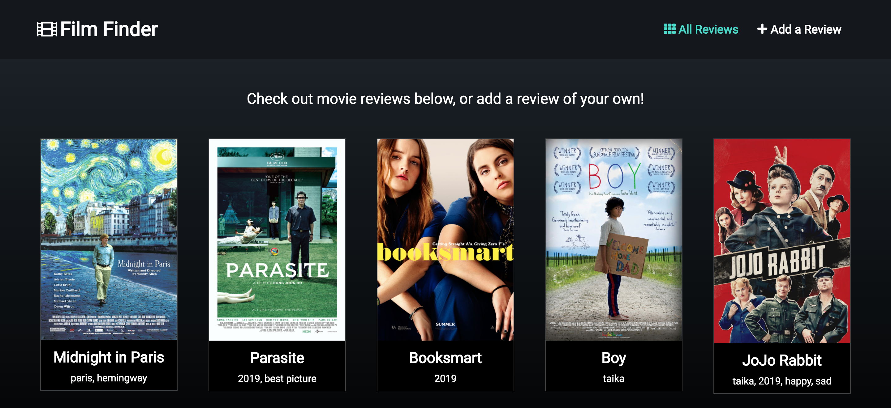
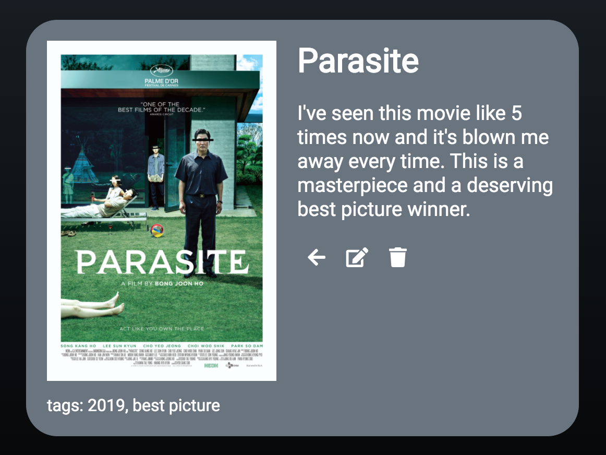

# Lab 4 Platform Client

For this lab, I built a movie review website called Film Finder. The deployed site is here: [Film Finder](http://jeremywasham-lab4-filmfinder.surge.sh/)

It took me a long time to figure everything out for this one, but I'm very happy with the final result. All of the lab specs are fully implemented: there are individual routes for new post, list view, and full post view, the app makes CRUD api calls to create, update, or delete a post, and to fetch a post by id or fetch all posts, and the content supports markdown. The site displays tiles for each movie review, with the movie title, cover image, and tags. The nav bar has routes to the main page (which displays all of the posts) and the new post page, with input fields for title, tags, cover URL, and content. I added some simple input validation here (which  doesn't allow you to create a post with any empty fields). When you click on a post, it displays the full post (routed by post ID) with the image, tags, title, and review, as well as some nice little icons to delete the post, edit the post, or go back to the main page. 

Going forward, I plan to add star reviews (using a React component library called react-star-rating), add author name to each review (once authentication is added), and add search and comments as well. I'd like it to be a site where people can log in and add reviews/ratings, search for reviews of their favorite movies, and comment on other people's reviews.

## Limitations
* I was hoping to do more with the styling (beyond just dark mode with white text and an accent color for hover effects,etc), but I ended up just going with a similar look to my previous lab (and honestly I like the look of that one a little bit more). That said, I am still happy with how it looks, so this isn't a huge hangup.
* I wanted to do more robust input validation, particularly for the cover URL, but I couldn't figure it out.
* I planned on combining my "new post" component and the "edit post" within my post component - they're almost identical and I ended up using a lot of the same code for both of them - but I didn't get a chance to refactor it.

## Attempted Extra Credit
* While it's similar to a blog, it is technically "something other than a blog" (a movie review website!) The distinctions should become a lot clearer once I finish lab 5 and SA8, especially once I add star ratings.
* I added very simple input validation - in "new post," it displays a little error message if you leave any of the fields blank, and it won't let you create a new post unless each field is filled in. 

## Screenshots
Here's what the tile view / default page looks like:

And here's an individual post:
